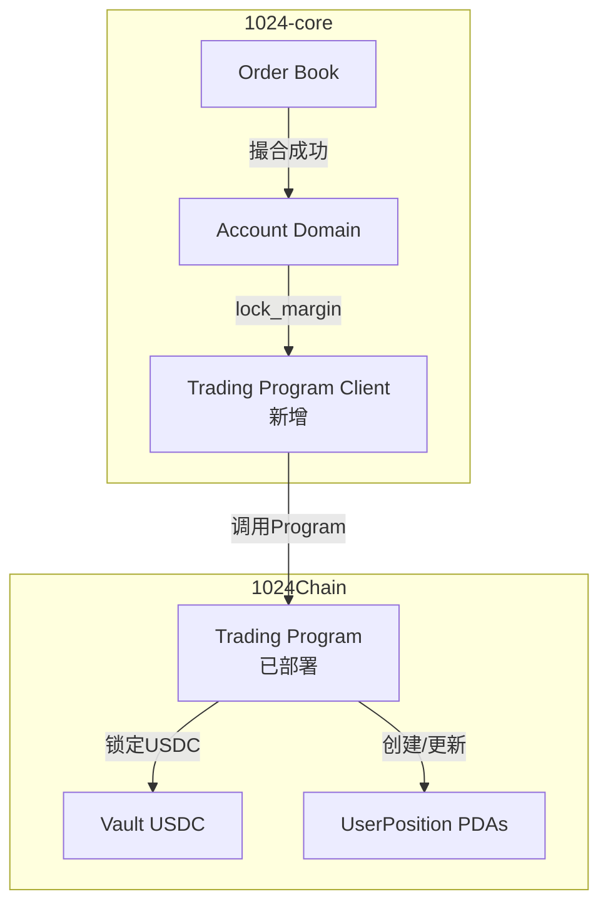

# 1024-core集成指南

> **版本**: v2.0.0  
> **创建日期**: 2025-11-13  
> **状态**: 准备就绪，待集成

---

## 概述

本文档说明如何将 Trading Program 集成到 `1024-core` 后端系统。

---

## 集成架构



---

## 步骤1: 创建trading-program-client Crate

### 1.1 创建新crate

```bash
cd 1024-core/crates
cargo new trading-program-client --lib
```

### 1.2 Cargo.toml配置

```toml
[package]
name = "trading-program-client"
version = "2.0.0"
edition = "2021"

[dependencies]
solana-sdk = "=1.18.26"
solana-client = "=1.18.26"
borsh = "0.10"
trading-program = { path = "../../../1024-trading-program" }
anyhow = "1.0"
thiserror = "1.0"
tokio = { version = "1.0", features = ["full"] }
tracing = "0.1"
```

### 1.3 实现TradingProgramClient

```rust
// crates/trading-program-client/src/lib.rs

use anyhow::Result;
use solana_client::rpc_client::RpcClient;
use solana_sdk::{
    commitment_config::CommitmentConfig,
    instruction::Instruction,
    pubkey::Pubkey,
    signature::{Keypair, Signature, Signer},
    transaction::Transaction,
};
use trading_program::{
    instruction::TradingInstruction,
    state::{Side, MarginMode},
};

pub struct TradingProgramClient {
    rpc_client: RpcClient,
    program_id: Pubkey,
    authority: Keypair,
}

impl TradingProgramClient {
    pub fn new(
        rpc_url: String,
        program_id: Pubkey,
        authority: Keypair,
    ) -> Self {
        let rpc_client = RpcClient::new_with_commitment(
            rpc_url,
            CommitmentConfig::confirmed(),
        );
        
        Self {
            rpc_client,
            program_id,
            authority,
        }
    }
    
    /// 开仓锁定保证金
    pub async fn lock_margin(
        &self,
        user: &Pubkey,
        account_id: String,
        market: String,
        side: Side,
        size_e6: i64,
        entry_price_e6: i64,
        leverage: u32,
        margin_mode: MarginMode,
    ) -> Result<Signature> {
        // 构造Instruction
        let instruction = TradingInstruction::LockMargin {
            account_id,
            market,
            side,
            size_e6,
            entry_price_e6,
            leverage,
            margin_mode,
        };
        
        // 序列化
        let data = borsh::to_vec(&instruction)?;
        
        // 派生PDAs
        let (vault_pda, _) = Pubkey::find_program_address(
            &[b"trading_vault"],
            &self.program_id,
        );
        
        // 构造accounts
        let accounts = vec![
            // ... UserPosition PDA, User, User USDC, Vault USDC, etc.
        ];
        
        let ix = Instruction {
            program_id: self.program_id,
            accounts,
            data,
        };
        
        // 发送交易
        let recent_blockhash = self.rpc_client.get_latest_blockhash()?;
        let transaction = Transaction::new_signed_with_payer(
            &[ix],
            Some(&self.authority.pubkey()),
            &[&self.authority],
            recent_blockhash,
        );
        
        let signature = self.rpc_client.send_and_confirm_transaction(&transaction)?;
        
        tracing::info!(
            "Lock margin successful: signature={}, user={}",
            signature,
            user
        );
        
        Ok(signature)
    }
    
    /// 平仓返还保证金
    pub async fn unlock_margin(
        &self,
        user: &Pubkey,
        account_id: String,
        market: String,
        close_size_e6: i64,
        exit_price_e6: i64,
    ) -> Result<(Signature, i64)> {
        // TODO: 实现unlock_margin逻辑
        // 返回 (signature, realized_pnl)
        todo!()
    }
    
    /// 强平
    pub async fn liquidate(
        &self,
        position_owner: &Pubkey,
        account_id: String,
        market: String,
        liquidation_price_e6: i64,
    ) -> Result<Signature> {
        // TODO: 实现liquidate逻辑
        todo!()
    }
}
```

---

## 步骤2: 集成到Account Domain

### 2.1 修改account-domain依赖

```toml
# crates/account-domain/Cargo.toml

[dependencies]
# ... 现有依赖
trading-program-client = { path = "../trading-program-client" }
```

### 2.2 修改AccountDomainService

```rust
// crates/account-domain/src/service.rs

use trading_program_client::TradingProgramClient;

pub struct AccountDomainService {
    db_pool: PgPool,
    // ... 现有字段
    
    // 新增
    trading_program: Option<Arc<TradingProgramClient>>,
}

impl AccountDomainService {
    pub fn new(
        db_pool: PgPool,
        // ... 现有参数
        trading_program: Option<Arc<TradingProgramClient>>,
    ) -> Self {
        Self {
            db_pool,
            // ...
            trading_program,
        }
    }
}
```

### 2.3 修改update_position_for_order

```rust
// crates/account-domain/src/service.rs

pub async fn update_position_for_order(
    &self,
    // ... 现有参数
) -> Result<()> {
    // 1. 读取当前持仓
    let position = self.position_repo.get(account_id, market).await?;
    
    // 2. 计算新持仓
    let new_size = position.size_e6 + qty_e6;
    
    // === Phase 2新增: Trading Program集成 ===
    if let Some(ref program) = self.trading_program {
        if position.size_e6 == 0 && new_size != 0 {
            // 🔥 开仓: 锁定USDC到Program
            tracing::info!("Opening position, calling lock_margin...");
            
            let sig = program.lock_margin(
                wallet,
                account_id.clone(),
                market.clone(),
                if qty_e6 > 0 { Side::Buy } else { Side::Sell },
                qty_e6.abs(),
                price_e6,
                leverage,
                margin_mode,
            ).await?;
            
            tracing::info!("✅ USDC locked on-chain: {}", sig);
        } else if new_size == 0 {
            // 🔥 完全平仓: Program返还USDC
            tracing::info!("Closing position, calling unlock_margin...");
            
            let (sig, realized_pnl) = program.unlock_margin(
                wallet,
                account_id.clone(),
                market.clone(),
                qty_e6.abs(),
                price_e6,
            ).await?;
            
            tracing::info!("✅ USDC returned from program: {}, PnL: {}", sig, realized_pnl);
        } else if position.size_e6 != 0 && new_size != 0 && 
                  (position.size_e6 > 0) != (new_size > 0) {
            // 🔥 反向: 先平仓旧持仓，再开仓新持仓
            // TODO: 实现
        }
    }
    // === Phase 2结束 ===
    
    // 3. 更新PostgreSQL (原有逻辑保持)
    self.position_repo.update(position).await?;
    
    // 4. 验证一致性
    if self.trading_program.is_some() {
        self.verify_balance_equals_onchain(wallet).await?;
    }
    
    Ok(())
}
```

---

## 步骤3: 数据一致性验证

### 3.1 实现验证函数

```rust
// crates/account-domain/src/service.rs

impl AccountDomainService {
    /// 验证PostgreSQL总余额 = 链上USDC
    async fn verify_balance_equals_onchain(&self, wallet: &Pubkey) -> Result<()> {
        // 1. 查询链上USDC
        let onchain_usdc = self.get_onchain_token_balance(wallet).await?;
        
        // 2. 查询PostgreSQL所有账户
        let accounts = self.account_repo.list_by_wallet(wallet).await?;
        let pg_total: i64 = accounts.iter().map(|a| a.balance_e6).sum();
        
        // 3. 严格验证（Phase 2必须相等）
        if pg_total != onchain_usdc {
            tracing::error!(
                "🚨 Balance mismatch! PG: {}, Chain: {}, Diff: {}",
                pg_total,
                onchain_usdc,
                pg_total - onchain_usdc
            );
            
            return Err(anyhow::anyhow!(
                "Balance mismatch! PG: {}, Chain: {}",
                pg_total,
                onchain_usdc
            ));
        }
        
        tracing::debug!(
            "✅ Balance verification passed: PG = Chain = {}",
            pg_total
        );
        
        Ok(())
    }
    
    async fn get_onchain_token_balance(&self, wallet: &Pubkey) -> Result<i64> {
        // 使用solana-client查询SPL Token余额
        // TODO: 实现
        todo!()
    }
}
```

---

## 步骤4: 配置和部署

### 4.1 环境变量配置

```env
# .env

# Trading Program配置
TRADING_PROGRAM_ID=TradingProgram11111111111111111111111111111
TRADING_PROGRAM_ENABLED=true
TRADING_PROGRAM_AUTHORITY=/path/to/authority-keypair.json
```

### 4.2 初始化

```rust
// server/src/main.rs

let trading_program = if env::var("TRADING_PROGRAM_ENABLED")
    .unwrap_or_default() == "true"
{
    let program_id: Pubkey = env::var("TRADING_PROGRAM_ID")?.parse()?;
    let authority = read_keypair_file(env::var("TRADING_PROGRAM_AUTHORITY")?)?;
    
    let client = TradingProgramClient::new(
        rpc_url.clone(),
        program_id,
        authority,
    );
    
    Some(Arc::new(client))
} else {
    None
};

let account_domain = AccountDomainService::new(
    db_pool.clone(),
    // ... 其他参数
    trading_program,
);
```

---

## 步骤5: 测试

### 5.1 单元测试

```rust
#[tokio::test]
async fn test_lock_margin_integration() {
    // 1. 初始化测试环境
    // 2. 调用lock_margin
    // 3. 验证链上USDC减少
    // 4. 验证PostgreSQL更新
    // 5. 验证一致性
}
```

### 5.2 端到端测试

```bash
# 1. 启动1024-core
cd 1024-core && cargo run

# 2. 用户下单
curl -X POST http://localhost:8080/api/orders \
  -d '{
    "account_id": "test_isolated",
    "market": "BTC-PERP",
    "side": "Buy",
    "size": 0.001,
    "price": 101885,
    "leverage": 20
  }'

# 3. 验证链上状态
solana account <POSITION_PDA> --url https://testnet-rpc.1024chain.com/rpc/

# 4. 验证PostgreSQL
psql -d perpetual_futures -c "SELECT * FROM positions WHERE market='BTC-PERP';"
```

---

## 故障处理

### 场景1: Trading Program调用失败

**问题**: lock_margin返回错误

**处理**:
1. 记录错误日志
2. 回滚PostgreSQL操作
3. 告警通知管理员
4. 临时禁用Program集成

### 场景2: 数据不一致

**问题**: PostgreSQL ≠ 链上USDC

**处理**:
1. 停止新交易
2. 触发对账reconcile
3. 生成差异报告
4. 手动修复数据

---

## 性能考虑

### 批量操作

对于高频交易场景，考虑：
- 批量调用Program（如果支持）
- 异步确认（乐观UI更新）
- 优先费用加速

### 降级策略

```rust
// 如果Program不可用，降级到Phase 1模式
if self.trading_program.is_none() {
    // 仅更新PostgreSQL
    self.position_repo.update(position).await?;
}
```

---

## 监控和告警

### 关键指标

- Lock margin成功率
- Unlock margin成功率
- 数据一致性验证通过率
- Program调用延迟

### 告警规则

- 一致性验证失败 → P0告警
- Program调用失败率 > 5% → P1告警
- 平均延迟 > 5秒 → P2告警

---

## 下一步

1. ✅ 实现TradingProgramClient基础功能
2. ✅ 集成到Account Domain
3. ⚪ 端到端测试
4. ⚪ Testnet部署验证
5. ⚪ 性能测试和优化

---

**文档版本**: v1.0  
**最后更新**: 2025-11-13  
**负责人**: Chuci Qin

